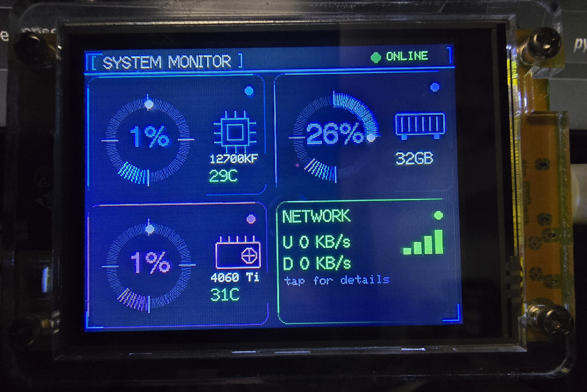

# CYD Windows PC Dashboard - Futuristic HUD Edition
<p align="center">
  
</p>
A touch-navigable system monitor for your Windows 11 PC, running on the
ESP32-2432S028 CYD, connected over USB serial.

- **HOME**: CPU ring gauge, RAM ring gauge, disk summary, network summary
- **Tap CPU** -> per-core load bars, frequency, temperature
- **Tap RAM** -> used/total, swap, top 3 memory-hungry processes
- **Tap DISK** -> all your fixed drives with usage bars
- **Tap NETWORK** -> live up/down speed + mini history graph + local IP
- Tap "< BACK" (top-left) on any detail page to return home

## Part 1 - Flash the ESP32

1. Install **Arduino IDE** 2.x, add ESP32 board support, and install:
   - `TFT_eSPI` by Bodmer
   - `ArduinoJson` by Benoit Blanchon
   - **`XPT2046_Touchscreen` by Paul Stoffregen** (new - needed for touch)
2. Overwrite `Documents\Arduino\libraries\TFT_eSPI\User_Setup.h` with
   `esp32/User_Setup.h` from this project. This project uses **ILI9341**
   (confirmed working on your board) - if yours needs ST7789 instead, see
   the comments in that file.
3. Plug in the CYD (USB-C or Micro-USB, not a C-to-C cable), select
   **Tools > Board > ESP32 Dev Module** and the right COM port.
4. Open `esp32/cyd_dashboard.ino` and Upload.

You should see a black screen with "SYSTEM MONITOR" and two glowing ring
gauges (CPU/RAM), a DISK row, and a NETWORK row.

## Part 2 - Run the Windows agent

1. `pip install -r requirements.txt` inside `windows_agent/`
2. (Optional) open `pc_monitor_agent.py` and edit `DRIVE_LABELS` near the
   top if you want custom names for your drives, e.g.:
   ```python
   DRIVE_LABELS = {"C:\\": "SSD-1", "D:\\": "SSD-2",
                    "E:\\": "HDD-1", "F:\\": "HDD-2"}
   ```
   Leave it as `{}` to just show the raw drive letters (C:, D:, etc).
3. Run it:
   ```
   python pc_monitor_agent.py
   ```
   It auto-detects the CYD's COM port (CH340 device). If it can't:
   ```
   python pc_monitor_agent.py --list
   python pc_monitor_agent.py --port COM5
   ```
4. The status dot on the CYD (top-right of the title bar) turns from red
   to green once data starts flowing.

### Run automatically on Windows startup
Put this in a `.bat` file and drop a shortcut to it in `shell:startup`:
```
@echo off
cd /d "C:\path\to\windows_agent"
python pc_monitor_agent.py
```

## Touch calibration

Touch should work out of the box with the default calibration values in
`cyd_dashboard.ino` (`TS_MINX/MAXX/MINY/MAXY`), which are typical for this
board. If taps land in the wrong place, are inverted, or don't register:

1. In `cyd_dashboard.ino`, uncomment `#define PRINT_TOUCH_RAW`
2. Re-upload, open **Tools > Serial Monitor** at 115200 baud
3. Tap each corner of the screen and note the raw x/y values printed
4. Update `TS_MINX`, `TS_MAXX`, `TS_MINY`, `TS_MAXY` with what you saw
5. Comment `PRINT_TOUCH_RAW` back out and re-upload

If X and Y feel swapped, swap the `map()` calls for x and y in the
`readTouch()` function.

## CPU temperature setup

Windows doesn't let plain Python read CPU temperature directly, so this
uses **LibreHardwareMonitor** as a bridge - it's free, safe, and widely
used for exactly this.

1. Download it from https://github.com/LibreHardwareMonitor/LibreHardwareMonitor/releases
   (get the `.zip`, no installer needed - just extract it)
2. Run `LibreHardwareMonitor.exe` **as Administrator** (right-click ->
   "Run as administrator") - sensor access requires this
3. Leave it running in the background (minimizing is fine)
4. `pip install -r requirements.txt` again to pick up the new `wmi` and
   `pywin32` packages
5. Run `pc_monitor_agent.py` as normal - CPU temp should now show up on
   the CYD's CPU detail page

If LibreHardwareMonitor isn't running, the agent just quietly skips the
temperature field (shows "n/a" on screen) - it won't crash or error out.

**Tip**: set LibreHardwareMonitor to start automatically with Windows
(Options menu) so you don't have to remember to launch it before running
the Python agent.

## Troubleshooting

- **Wrong colors / blank screen**: see the driver notes in `User_Setup.h`
  (ILI9341 vs ST7789 depends on your exact board batch).
- **Touch doesn't respond**: double check the XPT2046 pins in the sketch
  match your board (`XPT2046_CLK=25, MOSI=32, MISO=39, CS=33, IRQ=36` is
  the standard CYD wiring) and see calibration steps above.
- **CPU temperature blank**: see the "CPU temperature setup" section
  above - it needs LibreHardwareMonitor running as Administrator.
- **Board won't power via USB-C**: use Micro-USB or a USB-A-to-C cable;
  this board's USB-C port has no CC resistors for C-to-C cables.
- **A drive is missing from the DISK page**: `get_disks()` in the Python
  agent only picks up fixed drives with a valid filesystem, capped at 4.
  Run `python -c "import psutil; print(psutil.disk_partitions())"` to see
  what psutil detects on your machine.

## Ideas to extend further
- Add a 5th "settings" page (brightness, refresh rate) via a long-press
- Swap the per-core bar chart for a small live line graph
- Add GPU usage/temp via `nvidia-smi` (NVIDIA) or LibreHardwareMonitor's
  GPU sensors (same WMI namespace, just filter for "GPU Core" instead of
  "CPU Package") - there's already room for it in the JSON payload
